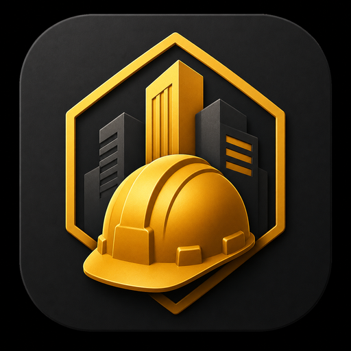
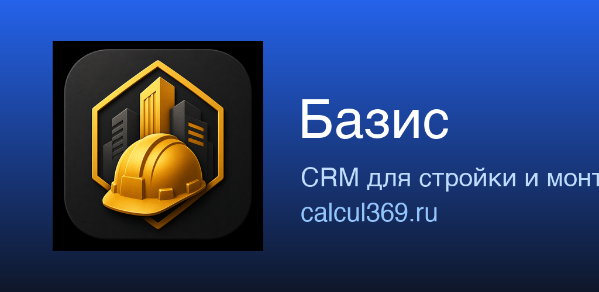
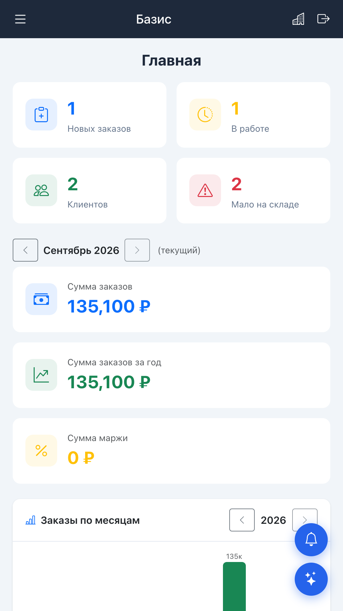
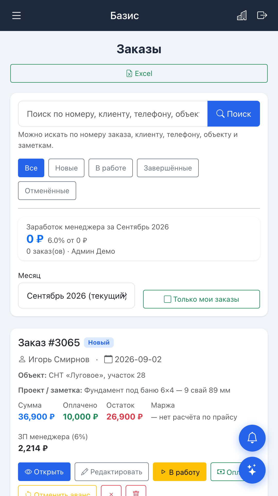
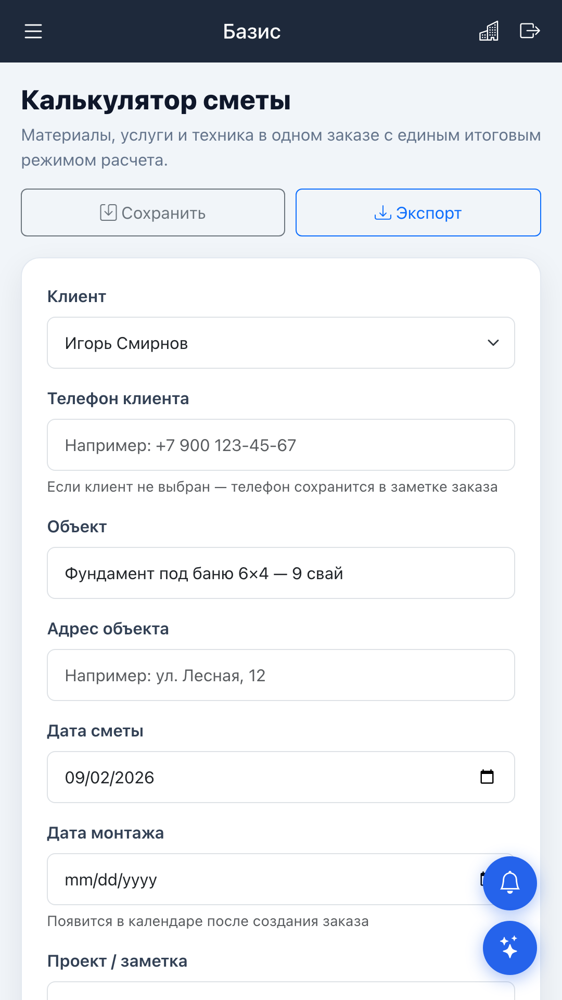
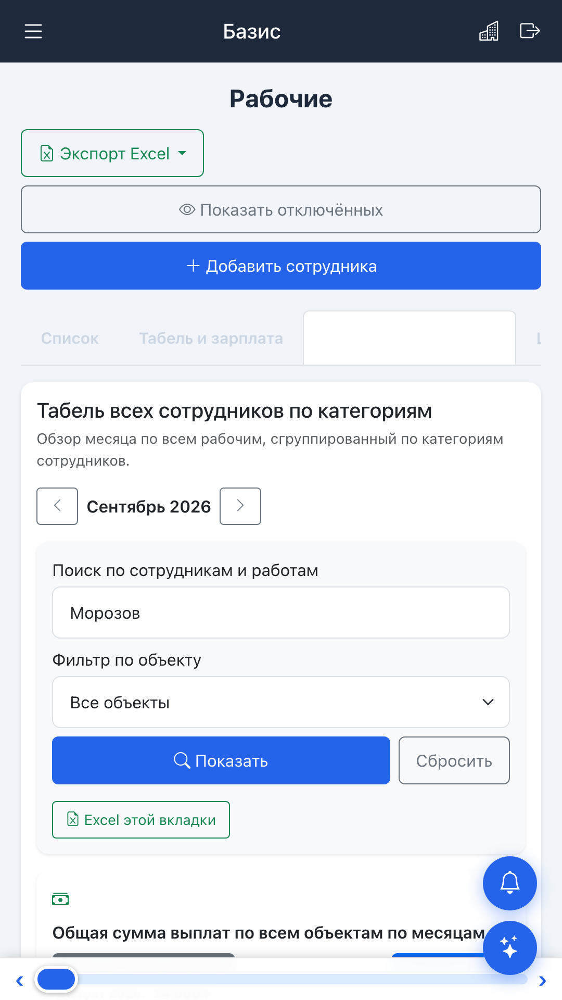
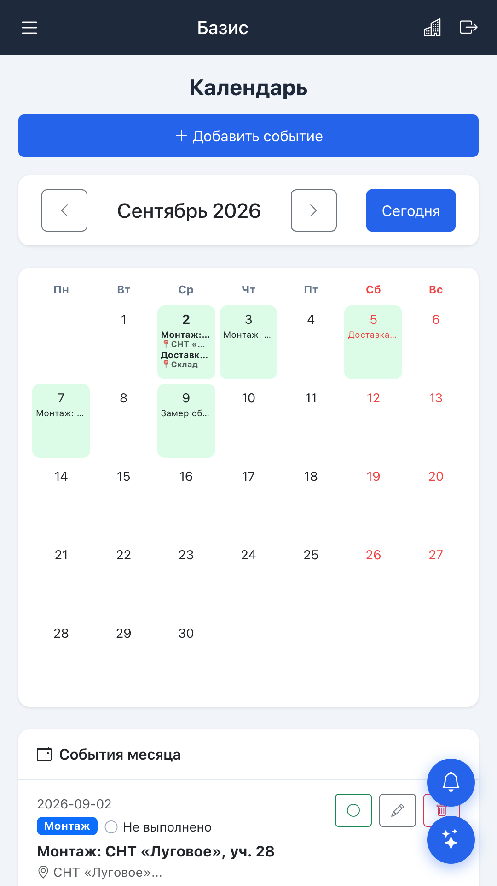

  

<h1 align="center">БАЗИС</h1>

  <strong>CRM для строительных, монтажных и производственных компаний</strong>

  Сметы, заказы, объекты, сотрудники, склад, календарь и экономика компании — в одной системе.

  <a href="https://calcul369.ru"><strong>Открыть БАЗИС →</strong></a>

  

---

## Зачем нужен БАЗИС

Когда расчёты находятся в одних таблицах, объекты — в других, сотрудники пишут в чатах, а оплаты и материалы приходится сверять вручную, руководителю сложно быстро увидеть реальное состояние компании.

**БАЗИС объединяет ключевые процессы в одном рабочем пространстве.**

| Возможность | Что даёт |
|---|---|
| 🧮 **Калькулятор и сметы** | Материалы, услуги и техника в одном расчёте |
| 📦 **Заказы и объекты** | Статусы, оплаты, остатки и история работы |
| 💰 **План–факт и экономика** | Контроль расходов, себестоимости и результата |
| 📅 **Календарь и рабочий журнал** | Монтажи, доставки, замеры и события |
| 👥 **Сотрудники и табель** | Рабочее время, сдельные работы, авансы и выплаты |
| 🏭 **Склад и снабжение** | Заявки, приход, списание и остатки |
| 🔔 **Центр уведомлений** | Важные события и проблемы в одном месте |
| 🤖 **ИИ-помощник** | Помощь по системе и рабочим расчётам |
| 📘 **Помощь и обучение** | Инструкции и интерактивное обучение внутри CRM |

---

## Как выглядит БАЗИС

<table>
  <tr>
    <td align="center"><strong>Главный экран</strong>  </td>
    <td align="center"><strong>Заказы</strong>  </td>
    <td align="center"><strong>Калькулятор</strong>  </td>
  </tr>
  <tr>
    <td align="center"><strong>Табель</strong>  </td>
    <td align="center"><strong>Календарь</strong>  </td>
    <td align="center"><strong>Единая система</strong>  Данные компании связаны между собой и доступны из одного рабочего пространства.</td>
  </tr>
</table>

---

## Для кого

### 🏗 Строительные и монтажные компании

БАЗИС помогает пройти путь от расчёта клиенту до выполнения работ и контроля результата: объекты, сметы, оплаты, сотрудники, календарь, материалы и экономика.

[Подробнее →](docs/construction.md)

### 🏭 Производственные компании

Система развивается и для производственных сценариев: заказы, задачи, сотрудники, материалы, контроль исполнения и управленческая информация.

[Подробнее →](docs/production.md)

---

## Единая карточка объекта

По объекту можно собрать рабочую информацию в одном месте и не искать её по разным разделам и перепискам.

В развитии карточки объекта мы делаем акцент на трёх вещах:

1. **единая информация по объекту;**
2. **план–факт и экономика;**
3. **проблемы и уведомления, требующие внимания.**

---

## Обновления продукта

Новые функции и заметные улучшения публикуются в отдельной открытой ленте.

- 🆕 [Все обновления БАЗИС](updates/README.md)
- ⚙️ [Как работает автоматическая публикация](docs/PUBLISHING.md)

Публикация устроена безопасно: публичный процесс получает только специально подготовленное описание изменения и не читает исходный код закрытых репозиториев.

---

## Развитие БАЗИС

Публично показываем основные направления развития продукта, но не публикуем исходный код, серверные настройки, секреты и клиентские данные.

- 🗺 [Дорожная карта](ROADMAP.md)
- 📝 [История изменений](CHANGELOG.md)
- 📖 [Обзор продукта](docs/overview.md)

---

## Начать работу

Для работы нужен аккаунт организации БАЗИС.

👉 **https://calcul369.ru**

Поддержка: **support@calcul369.ru**

---

  <strong>БАЗИС — меньше разрозненных таблиц, больше контроля над компанией.</strong>

